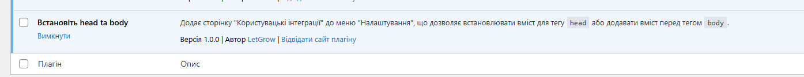

# Wordpers plugin - Set custom head and body scripts

This plugin allows for custom integrations by easily setting the head and body sections of your WordPress site. We keep it simple and straightforward, ensuring safety and reliability. The code is open-source, allowing you to verify it yourself. You can use it to add google analytics or google search console tags.

## When to use this plugin?

This is the fastest way to add your custom code to the page head tag or before the body closing tag.

## How does it look like?

### English


### УкраЇнські




## Any questions?

Leave a PR or create an issue, don't hesistate!

## Features

- [x] - attach custom content to head tag
- [x] - attach custom content before body tag
- [x] - fully integrated WordPress look, no frills
- [x] - multilangual, supported languages: pl-PL, uk-UA, en-US
- [x] - cleanup on deactivation
- [x] - separete client and admin code
- [x] - Add troubleshooting section
- [ ] - help tabs - nice explanations for non technical users
- [ ] - enforce WordPress coding standards: https://developer.wordpress.org/coding-standards/wordpress-coding-standards/

## Support

Requires at least WordPress v6.4.3

## Development

### Localization

Feel free to pull request new translations!

Generate pot files

```
docker compose run --rm wp-cli i18n make-pot wp-content/plugins/letgrow-head-and-body
```

#### PO to MO files

##### УкраЇнські

```
msgfmt -o languages/letgrow-head-and-body-uk.mo languages/letgrow-head-and-body-uk.po
```

##### Polski

```
msgfmt -o languages/letgrow-head-and-body-pl_PL.mo languages/letgrow-head-and-body-pl_PL.po
```
